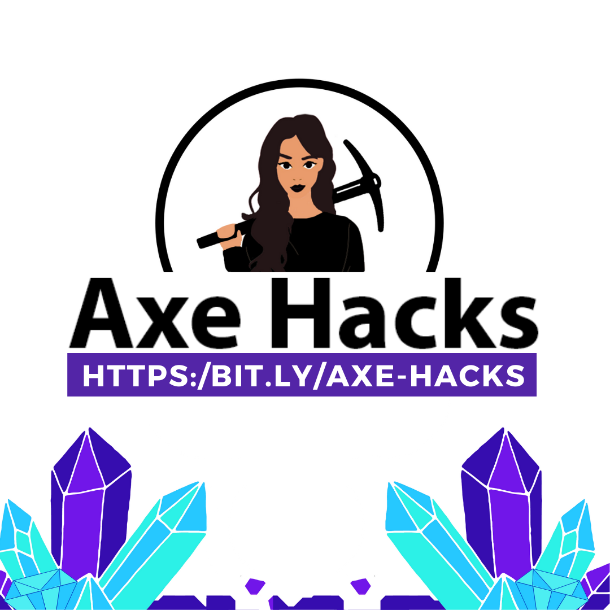

What a week! 🎉

Thank you all for making our VERY FIRST Axe Hacks so special! We had so much fun getting to know our Hackers and Mentors throughout the week, playing games, learning new tools and languages, and more.

Congratulations to all of those who participated in the hackathon, and to all those who submitted and had winning projects! We are so proud of all of the hackers, many first-timers, who teamed up and created something new together. Check out the project submissions on our [Devpost Project Gallery](https://lnkd.in/db5SMS2G)!

Thank you again to all our volunteers and sponsors who made this event possible, including companies like echo3D, Incovate Solutions, Lotus Digital Consulting LLC, and all the individual donations!

We want to give a special shout out to our Director Ashley Harmon, our Organizers Zaina Shawar and Elise Frazier, our Treasurer Chanel Briggs, our Event Hosts Rebecca Hailu, Allyson Vasquez, and all the amazing women on the Executive Boards of [Girls Who Code at UNC Charlotte](https://www.instagram.com/girlswhocode_uncc/) and [ACMW at UNC Charlotte](https://www.instagram.com/acmw_uncc/) who helped advertise and coordinate this event.

You can view the full list of Sponsors, Mentors, and Judges in the images below! Also our full list of Axe Hacks Team Members can be found on our [website](https://bit.ly/axe-hacks).

---
##### More details on this event recap coming soon!
---

