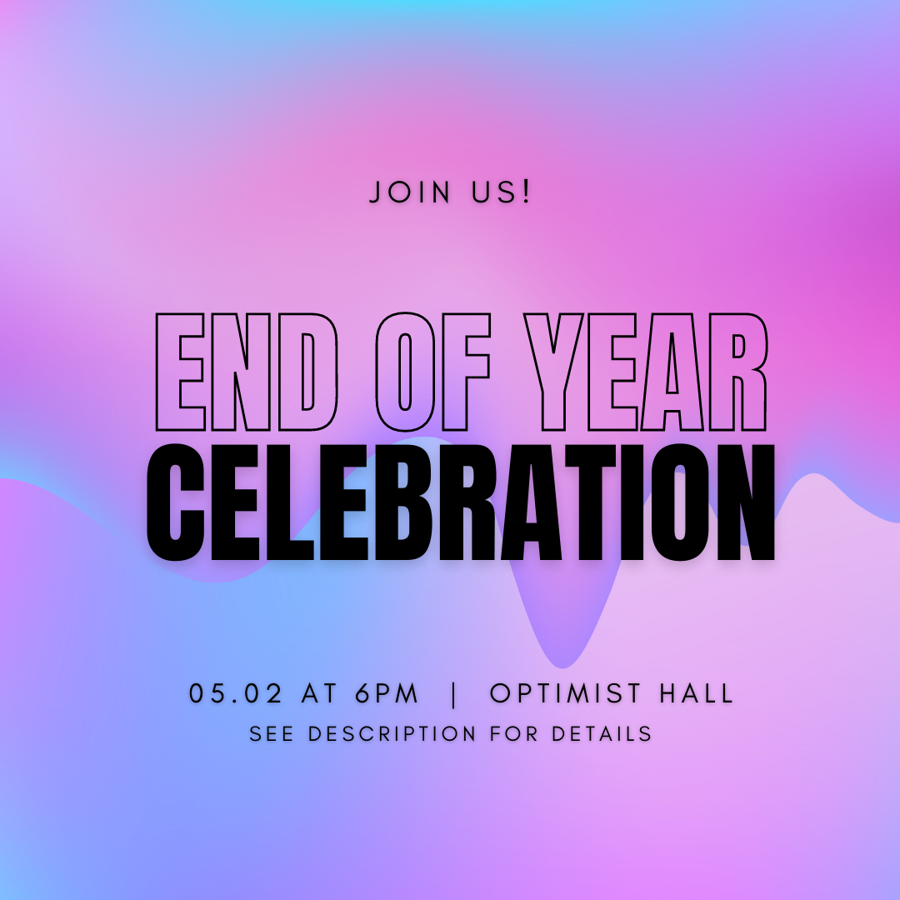

We've had an AMAZING year! 😍\
\
We want to give a HUGE thank you to all who were a part of our organization this year and a big shoutout to our e-board members who have planned and hosted our events: Elise Frazier, Zaina Shawar, Ashley Harmon, Kaitlyn Gosline, Ayushi Patel, and Chanel Briggs!\
\
Thank you to all of the businesses, orgs, and individuals who partnered with us on events: Slalom Build, Centene, CyberHype Clt, ACMW at UNCC, and so many others!\
\
We also want to say CONGRATULATIONS to our amazing e-board members, Chanel Briggs and Ayushi Patel, GWC members, Rebecca Hailu, Michelle Camacho, Lulu Aboufoul, and all those graduating this semester! 🎉 It has been wonderful getting to know you all.

🎥 Check out our Full [EOY Recap Video](https://www.youtube.com/watch?v=EBWwf3zlrYA).\
\
We hope everyone enjoys their summer break, and we'll see you in August!

