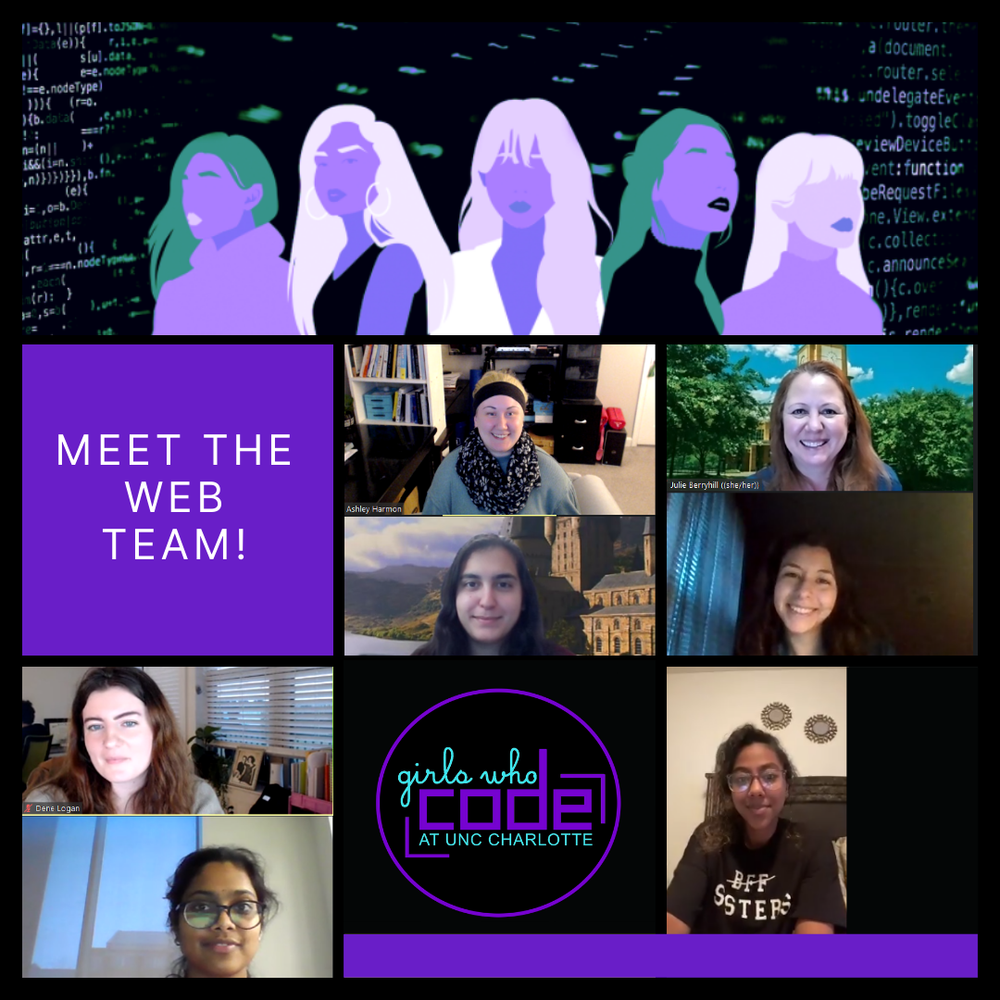

**WE DID IT!** As of May 2nd, 2022, our GWC Web Team has officially launched this new website for our organization! You can see all of the amazing people involved in this project and learn more about the process below.

&nbsp;

### Meet the Team

We are **so proud** of our Web Team that put in so much time and effort to learn to design and develop this website:

##### Ashley Harmon

###### Team Lead | Designer | Developer

Ashley is a MSIT student set to graduate this Fall of 2022 with a concentration in Human-Computer Interaction. We want to give a huge shoutout to Ashley for her work putting the team together, setting up our repo, and teaching workshops to help people get involved with Figma, GitHub, VS Code, and Hugo! She also led the weekly meetings, created and updated our Web Team Guide, and worked with Zaina and Alex to get the remaining issues completed for the initial website launch. Learn more about Ashley [here](https://www.linkedin.com/in/ashharmon/).

##### Zaina Shawar

###### Designer | Lead Developer

Zaina is a senior undergaduate student set to graduate this Fall of 2022, double majoring in Computer Science: Cyber Security and Management Information Systems. We want to give a huge shoutout to Zaina for her dedication in attending our weekly meetings, her work with Ashley to complete the Figma Prototype, helping structure the Web Team's work, and all of her hard work learning to work with our Hugo theme! Learn more about Zaina [here](https://www.linkedin.com/in/zaina-shawar/).

##### Michelle Camacho

###### Developer | Analyst

Michelle is a senior undergraduate student set to graduate this Fall of 2022, majoring in Business Administration and Marketing. She is also minoring in Human-Centered Design. We want to thank Michelle for her dedication in attending our weekly meetings, all of her hard work learning to work with our Hugo theme, asking great questions at our weekly meetings, and helping to review the website to report any bugs before the final launch! Learn more about Michelle [here](https://www.linkedin.com/in/camachomichelle/).

##### Dene Logan

###### Developer | Analyst

Dene is a junior undergaduate student majoring in Web and Mobile App Development. We want to thank Dene for her dedication in attending our weekly meetings, all of her hard work learning to work with our Hugo theme, asking great questions at our weekly meetings, and helping to review the website to report any bugs before the final launch! Learn more about Dene [here](https://www.linkedin.com/in/dene-logan/).

##### Mariam Conde

###### Developer

Mariam is a sophomore undergraduate student majoring in Computer Science. We want to thank Mariam for her dedication in attending our weekly meetings and all of her hard work learning to work with our Hugo theme! Learn more about Mariam [here](https://www.linkedin.com/in/mariam-conde-7b0a051a8/).

##### Liyu Tenaw

###### Analyst | Trainee

Liyu is a sophomore undergraduate student majoring in Computer Science: Data Science. We want to thank Liyu for her dedication in attending our weekly meetings, exploring new concepts, and helping to review the website to report any bugs before the final launch! Learn more about Liyu [here](https://www.linkedin.com/in/liyu-tenaw-1836b31b4/).

##### Alex Rodriguez

###### Team Advisor | Outside Collaborator

Alex wears many hats in his work as a developer, pentester, and creating and maintaining infrastructures. We want to give **a huge thank you** to Alex for helping us with a multitude of things like learning how to use Hugo shortcodes, setting up our repo to deploy the website with GitHub pages, and helping with the more complicated development pieces. Check out Alex's blog [here](https://elrey.casa/me).

&nbsp;

### Team Positions

Our Web Team had 4 different positions available: Developer, Analyst, Archivist, and Trainee. For clarity, we have broken the role descriptions down below:

##### **Developers** | Responsible for editing and contributing to the website’s code

aka “Coders” who edited the current template code to match our Figma design and should have good documentation of their code.

##### **Analysts** | Responsible for raising, organizing, and tracking issues

aka “Reviewers” who could submit bug reports, feature requests, etc. Reviewers used our Figma design to determine if anything is missing or needs improvement.

##### **Archivists** | Responsible for keeping the repo and code easy to understand and maintain

aka “Documenters” who should add comments to code, work with Markdown files, document our team’s workflow and organization, and add ideas to help keep the repo maintainable and scalable.

##### **Trainees** | Just want to be included to watch and learn

aka “Observers” who wanted to come watch and work on the learning materials without officially being on the team.

&nbsp;

### Our Story

This project has been a labor of love of our Team Lead, [Ashley Harmon](https://www.linkedin.com/in/ashharmon/), since her [initial prototype](https://youtu.be/6yToLcz0ufo) creation in 2020 and initial [single-page site](https://gwc-uncc.github.io/myportfolio/) in 2021. Together, Ashley and [Zaina Shawar](https://www.linkedin.com/in/zaina-shawar/) created a [new prototype](https://www.figma.com/proto/YcMIVm9QH4AwPdtsDZqeQW/GWC-Website-Prototype?node-id=314%3A1042&scaling=scale-down-width&page-id=238%3A733&starting-point-node-id=314%3A1293) adapted from a [Hugo theme](https://themes.gohugo.io/themes/roxo-hugo/). Now, with the help of our Spring 2022 Web Team, we finally reached our initial launch!

Please note that the following are still being worked on: mobile responsiveness, event recaps, cleaning up and documenting the code. You can check out our [Web Team Guide](https://docs.google.com/document/d/1sxgaEG-Hd6xzkNaAmkmxFyy-j7IfFRTG25rmfYCoOFg/edit#) for more information on, and resources related to, our project.

Here is a message from Ashley Harmon on the process, timeline, and teamwork:

> I cannot say enough about how happy I am that we have launched our new website! I am so grateful for the Web Team coming together this semester and getting this accomplished. 💜\
> \
> This has been a project in the works for a while (as most personal projects are when you are working and going to school).
>
> **Fall 2020**\
> I created the initial prototype with Wix (before I knew how to use any prototyping tools), and it was selected as the winner of GWC's Prototype Showcase! "Phoebe", the "terminal chatbot" was quite ambitious, but I thought this would be a cool addition someday.\
> Initial Prototype: <https://lnkd.in/ggrznRs6>\
> \
> **Spring - Fall 2021**\
> I began creating and teaching workshops to help everyone (including myself) get acquainted with GitHub, VS Code, Hugo, HTML, CSS, and more throughout the year. We also decided on the Hugo theme we would use to avoid having to build this site from scratch.\
> GWC Workshops: <https://lnkd.in/gvn2JmsC>\
> \
> **August 2021**\
> I created a temporary single-page site for GWC to use.\
> Initial Website: <https://lnkd.in/gyef8b_Q>\
> \
> **January 2022**\
> [Zaina Shawar](https://www.linkedin.com/in/ACoAAC36mwMBhfVmxDLwVIsChNrdQ9dGce7anmY) and I designed a new prototype to adapt the old one to the chosen Hugo theme (in hopes of making the development process easier for everyone). This time, we used Figma, both learning as we went and troubleshooting together.\
> Hugo Theme: <https://lnkd.in/gHvx_kVq>\
> Figma Prototype: <https://lnkd.in/gBh92jpi>\
> \
> Once the prototype was ready, I worked on our Web Team Guide and we started forming the team of women you see below.\
> Web Team Guide: <https://lnkd.in/gDn5JNH4>\
> \
> **May 2022**\
> A few months later and we can officially say our new website is LIVE! 🎉\
> \
> Like the original post said, "This project will definitely be a work in progress as we continue to improve and enhance it with those who come behind us, and we look forward to seeing it grow!" There are some bugs to fix and code cleanup/documentation to do before I pass it on, but I am so proud of this first big step and getting to leave behind a project that future GWC members can contribute to!\
> \
> Thank you to [Girls Who Code at UNC Charlotte](https://www.linkedin.com/company/girls-who-code-at-unc-charlotte/) for trusting me to lead this project. And thank you again to my fellow team members [Zaina Shawar](https://www.linkedin.com/in/ACoAAC36mwMBhfVmxDLwVIsChNrdQ9dGce7anmY), [Michelle Camacho](https://www.linkedin.com/in/ACoAADR7iscBb8fAuhFUSUkLVfCTyooORHB89uk), [Dene Logan](https://www.linkedin.com/in/ACoAADch5_oBmmiGOviH1fqhnKH4whBN4KUf0wM), [Mariam Conde](https://www.linkedin.com/in/ACoAADCPHjQBiMqO6nuCX6eJJI0V5rfy1kNUGRw), and [Liyu Tenaw](https://www.linkedin.com/in/ACoAADHv2DMBwOvz7q3x-t7JWPw9rSTktc2TE08) for your commitment to our weekly meetings even with all of our crazy schedules, asking great questions, being willing to challenge yourselves, and having fun with this.\
> \
> I also want to say thank you to our team's Advisor and Outside Collaborator, [Alex Rodriguez](https://www.linkedin.com/in/ACoAABHmz2wB373NcawRKqsnoVsAiiMayv_7ZfU), for all of his help with some of the more difficult aspects of development, working with Hugo, and setting up our deployment.

Congrats and thank you again to the Web Team for all your hard work! We look forward to future Web Teams and seeing this site grow with this awesome organization.