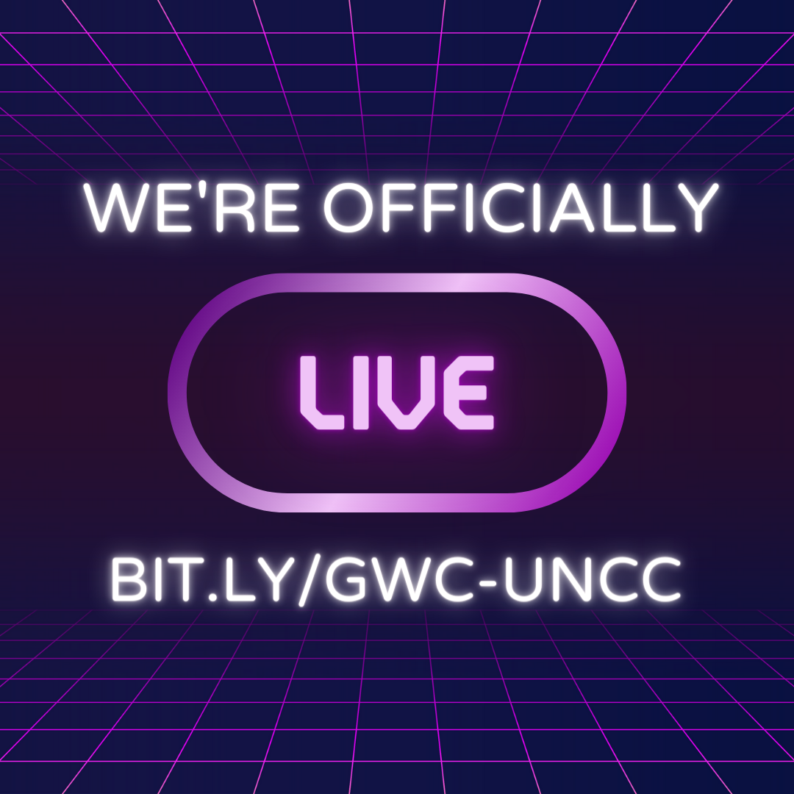

**WE DID IT!** As of May 2nd, 2022, our GWC Web Team has officially launched this new website for our organization! You can see all of the amazing people involved in this project and learn more about the process below.

### Shout Outs
We are __so proud__ of our Web Team that put in so much time and effort to learn to design and develop this website:

##### Ashley Harmon
###### Team Lead | Designer | Developer
Ashley is a MSIT student set to graduate this Fall of 2022 with a concentration in Human-Computer Interaction. 

We want to give a huge shoutout to Ashley for her work putting the team together, setting up our repo, and teaching workshops to help people get involved with Figma, GitHub, VS Code, and Hugo! She also led the weekly meetings, created and updated our Web Team Guide, and worked with Zaina and Alex to get the remaining issues completed for the initial website launch.

&nbsp;

##### Zaina Shawar
###### Designer | Lead Developer
Zaina is a senior undergaduate student set to graduate this Fall of 2022, double majoring in Computer Science: and __

We want to give a huge shoutout to Zaina for her work with Ashley to complete the Figma Prototype and help structure the Web Team work.  

&nbsp;

##### Michelle Camacho
###### Developer | Analyst
Michelle was a Developer and Analyst for our website.

&nbsp;

##### Dene Logan
###### Developer | Analyst
Dene was a Developer and Analyst for our website.

&nbsp;

##### Mariam Conde
###### Developer
Mariam was a Developer for our website.

&nbsp;

##### Liyu Tenaw
###### Analyst | Trainee
Liyu was an Analyst and Trainee for our website.

&nbsp;

In addition to our Web Team members, we want to give a **huge thank you** to our Team Advisor:
##### Alex Rodriguez
As our Team Advisor and an Outside Collaborator, Alex helped us with a multitude of things like learning how to use Hugo, setting up our repo to deploy the website with GitHub pages, and helping with the more complicated develop pieces. 

&nbsp;

### Team Positions
Our Web Team had 4 different positions available: Developer, Analyst, Archivist, and Trainee. For clarity, we have broken the role descriptions down below:

##### Developers 
This role 

##### Analysts
This role

##### Archivist
This role

##### Trainees
This role

&nbsp;

### Our Story
This project has been a labor of love of our Team Lead, Ashley Harmon, since her initial prototype creation in 2020 and initial single-page site in 2021. And with the help of our Spring 2022 Web Team, it has finally come into fruition for it's initial launch!

##### Fall 2020 
Girls Who Code at UNCC needed a website, and we had a Prototype Showcase where we would build a website based on the winning prototype in Fall 2020.

##### Spring 2021
In 2021, we began learning to use VS Code, GitHub, and a Hugo template (so we didn’t have to build from scratch). We also learned to use Figma to document our design plan.

##### Fall 2021
In

##### Spring 2022 
In the Spring of 2022, we officially dove into the development process!

---
#### Stay Tuned for More on Our Story!

---
